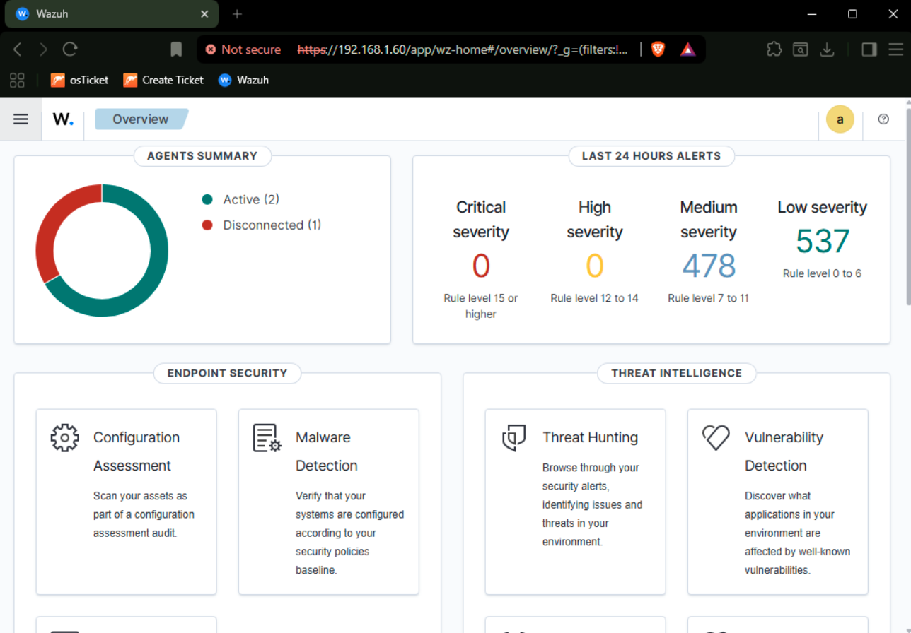
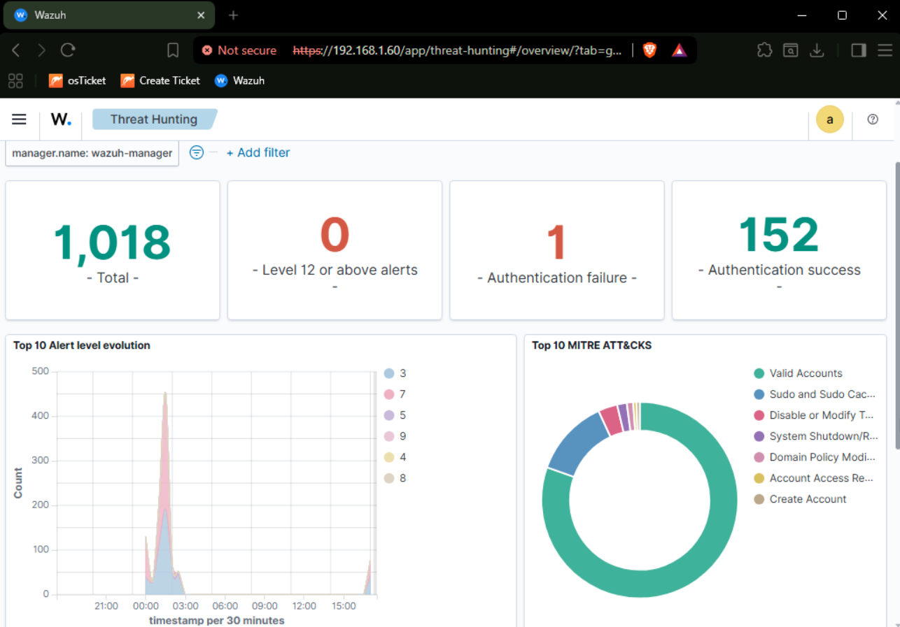
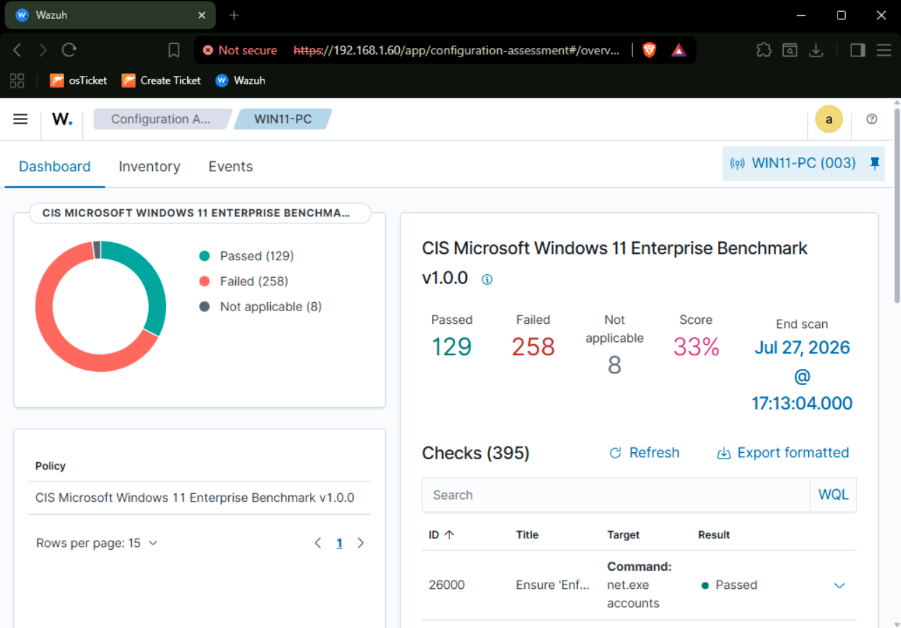
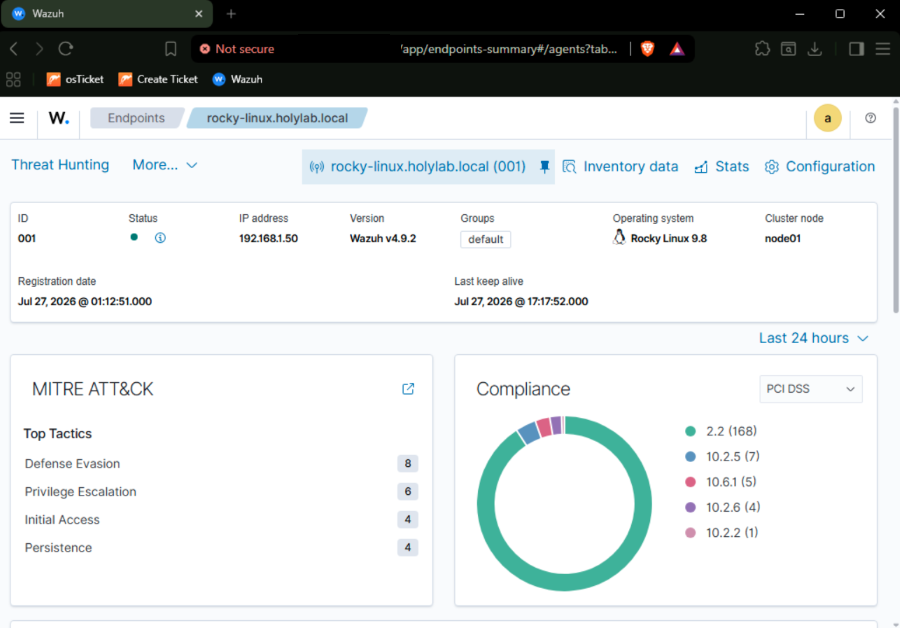

# Sentry Lab — Wazuh SIEM Defensive Security Buildout

A self-hosted Wazuh SIEM deployment (manager, indexer, and dashboard) monitoring a mixed Windows/Linux home lab environment. Built as Phase 4 of [Sentry Lab](https://github.com/st-castaneda/sentry-lab-core) — extends the existing AD/help-desk infrastructure with centralized log collection, agent-based endpoint monitoring, and (upcoming) vulnerability scanning and attack-detection work.

      

> ⚠️ **Lab Environment Only**
> All systems in this lab are self-owned and self-managed. Agent enrollment, detection rules, and any future attack simulation work are performed exclusively against infrastructure in this lab. Do not replicate offensive techniques against systems you do not own or have explicit permission to test.

---

## What's Built

| Phase | Component | Status |
|---|---|---|
| Step 1 | Wazuh Manager · Ubuntu Server, all-in-one (manager + indexer + dashboard), v4.9.2 | ✅ Complete |
| Step 2 | Agent Rollout · Windows Server AD DC, Windows 11, Rocky Linux — all enrolled and reporting | ✅ Complete |
| Step 3 | Vulnerability Scanning · Nessus Essentials + findings log | ✅ Complete |
| Step 4 | AD Attack & Defend · Kerberoasting / pass-the-hash + detections | 🔜 Queued |
| Step 5 | Kali → Metasploitable2 · Offensive traffic visible in Wazuh | 🔜 Queued |
| Step 6 | Honeypot · OpenCanary, Wazuh-integrated | 🔜 Queued |
| Step 7 | Incident Response Playbook · Formal IR doc from a real alert chain | 🔜 Queued |

---

## Screenshots

**All agents enrolled and reporting**



**Security events / threat hunting across the fleet**



**Win11 CIS benchmark scan (Security Configuration Assessment)**



**Rocky Linux — MITRE ATT&CK mapping + PCI DSS compliance**



---

## Architecture

The Wazuh manager runs as a dedicated Ubuntu VM on the lab's internal LAN bridge, separate from the Active Directory domain — it resolves DNS independently rather than depending on the DC, so it stays reachable even when other lab VMs are powered off. Agents are deployed to the three existing endpoints from Phases 1–3 (AD DC, Windows 11 workstation, Rocky Linux server), each reporting logs, file integrity, and system telemetry back to the manager for centralized triage.

Agent versions are pinned to match the manager (`4.9.2`) — Wazuh enforces that agents cannot run a newer version than the manager, so every install specifies the exact package rather than pulling latest.

---

## Notable Problems Solved

**Disk exhaustion from the vulnerability-detection feed queue.**

The manager's vulnerability-detection module re-fetches CVE feed data hourly with no cleanup, filling the disk over time. Root-caused via disk usage inspection, then fixed by disabling the module pre-install on rebuild and adding a logrotate policy for the manager's own logs.

**Cross-subnet access during setup.**

Direct SSH/console access to the manager VM wasn't reachable from the management workstation due to a WAN/LAN subnet split enforced by the firewall. Diagnosed with packet captures showing SYN packets arriving with no reply, then resolved once WireGuard tunnel routing was corrected (see the [Sentry Lab core repo](https://github.com/st-castaneda/sentry-lab-core) for the full writeup).

**DNS dependency chains.**

Endpoints pointed at the AD DC for DNS lose internet access whenever the DC is powered off — a real operational constraint when running a lean, profile-based lab where not every VM is on at once. Non-domain-joined boxes (Rocky, the Wazuh manager) were reconfigured to resolve through the firewall directly instead.

---

## Vulnerability Scanning — Nessus

Ran a full credentialed vulnerability assessment across all four lab hosts using **Nessus Essentials Plus** (Tenable for Education license), scanning from Kali via a temporary LAN-facing NIC that was removed and isolation-reverified after each scan wave.

Each host went through the same four-stage sequence: host discovery → uncredentialed baseline scan → credential validation → credentialed patch audit. The credentialed patch audit stage is what actually matters — it authenticates to each host and diffs installed package/patch versions against vendor advisories. Every meaningful finding in this project came from that stage; uncredentialed scans returned almost entirely Info-level noise on hosts that turned out to have double-digit Critical/High counts once authenticated.

### Results

| Host | Critical (before → after) | High (before → after) | Medium (before → after) |
|---|---|---|---|
| Windows Server 2025 (AD DC) | 6 → 0 | 19 → 0 | — |
| Windows 11 | 0 → 0 | 1 → 0 | — |
| Rocky Linux 9.8 | 5 → 0 | 13 → 0 | 5 → 0 |
| Wazuh manager | 0 → 0 | 0 → 0 | 0 → 0 |

**49 findings identified across 2 scan waves and 4 hosts — 100% remediated and re-verified via credentialed re-scan.**

- **Windows hosts:** all findings tied to missing Windows Updates plus a missing `EnableCertPaddingCheck` registry mitigation (CVE-2013-3900). Fixed via Windows Update + registry DWORD (64-bit and Wow6432Node paths), re-scanned clean.
- **Rocky Linux:** kernel, glibc, glib2, openssl, and openssh findings against RockyLinux's own RLSA security advisory feed. Remediated with `dnf update -y` + reboot into the patched kernel, re-scanned clean (0 Critical/High/Medium, Info-only remaining).
- **Wazuh manager:** clean baseline (built more recently, less time for CVEs to accumulate) aside from an expected self-signed-certificate Medium — not a remediation target for a homelab dashboard cert.

### Notable problem solved — credentialed scan auth failures

Both Windows and Linux credential setups initially failed authentication, and diagnosing *why* was its own finding worth documenting:

- **Windows 11:** `LanmanServer` (Server service) and the File and Printer Sharing firewall group are disabled by default on a Win11 client OS, so SMB ports 139/445 weren't listening. Fixed with `Start-Service LanmanServer` + enabling the firewall group, confirmed via `nmap -p 139,445`.
- **Windows Server:** credential validation failed because the domain was double-specified (domain in both the username field and the domain field). Fixed by using the bare admin username with domain specified separately.
- **Linux hosts:** SSH password auth alone doesn't expose enough package/file state for a full patch audit — both hosts required `sudo` privilege elevation configured explicitly in the scan policy before the credentialed audit could run.

Remediation isn't treated as done until re-verified: every host above was re-scanned post-patch to confirm the fix actually landed, not just applied.

---
## Repo Structure

```
sentry-lab-wazuh-siem/
├── README.md
├── install/           # manager install steps, logrotate config, hardware-check bypass notes
├── agents/            # per-platform agent enrollment steps (Windows MSI, Linux package)
└── screenshots/       # dashboard views, agent status, alert examples
```

---

## Related

- [Sentry Lab core](https://github.com/st-castaneda/sentry-lab-core) — Phase 1–3 infrastructure (Proxmox, OPNsense, Active Directory, help desk services, isolated security lab network)
- `soc-automation-scripts` *(planned)* — n8n-based SOAR workflows reacting to Wazuh alerts (ticket creation, enrichment, notifications); kept as its own repo since it's an automation/orchestration project layered on top of this SIEM, not part of the SIEM build itself
